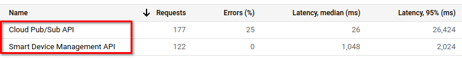
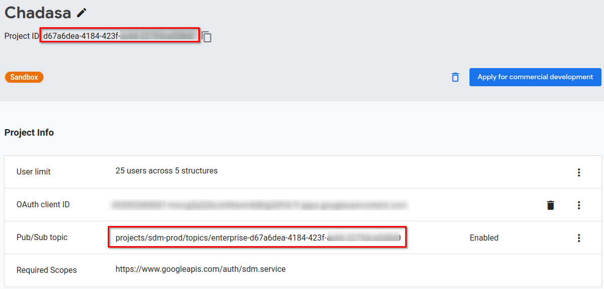
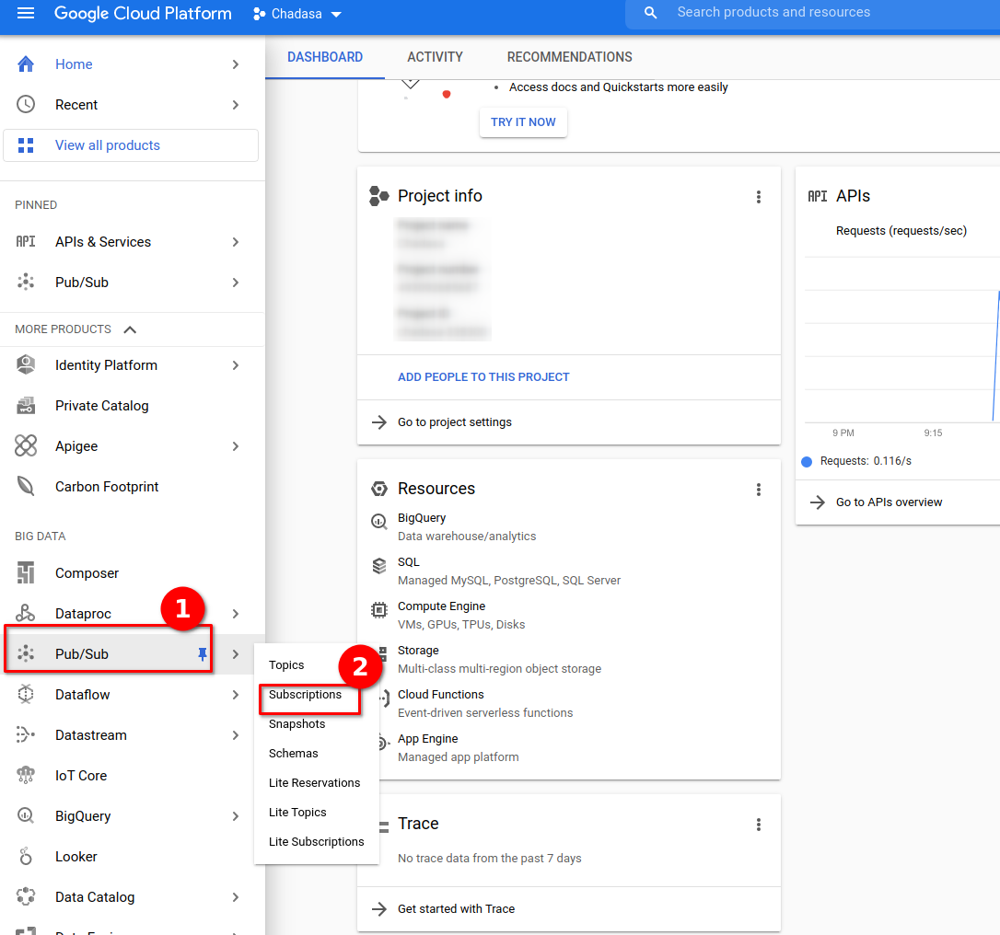
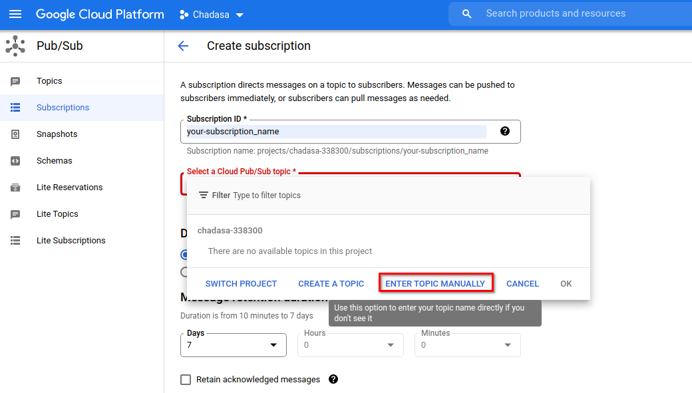
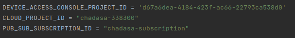
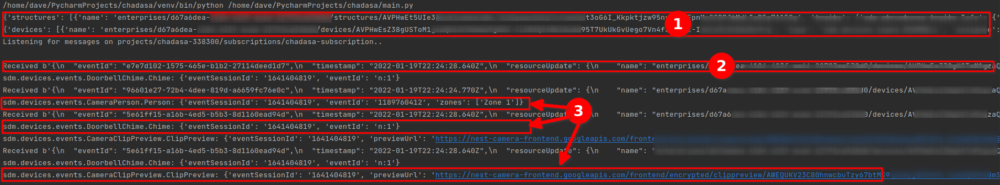

# Chadasa

This is the documentation for Chadasa. The plan for this will be to build
a simple wrapper library to interact with the Nest range of smart home
products. The API documentation offers code examples to list your devices
and structures (your home), but nothing else. This library will allow you
to respond to events. 

Google Nest doorbell does not allow routines to be triggered on doorbell press. 
The purpose of this project is to enable that, so I can flash the lights in
the house (hue) if the bell cannot be heard. Or indeed to trigger any number 
of other routines. For example:

- Boil the kettle or make fresh coffee when my mother is at the door.
- Stick on a party playlist when my friends arrive.
- Dim the lights and turn on th planetarium when my son arrives home.

## Getting started
To use this script, you need a Google cloud project, a device access
project and a pub/sub subscription. You need to set them up in that
order.

### 1) Set Up Google Cloud Project
You can follow the getting started guide here 
https://developers.google.com/nest/device-access/get-started

Once you've completed the basic setup as per the guide above, you'll need
to grab your OAUTH credentials file from your Google Cloud project. Download
the **oauth credentials json file** and keep it in a safe place.

### 2) Set up Device Access Console Project
Warning, you have to pay $5 for this. Set up the device access console as per
the same link above. You'll need the OAuth client ID from your json credentials
file above to get this set up. Make sure you tick the "Enable Events" checkbox
when creating your project. 

Once you're set up and paid, you need to grab:

- Your Project ID
- Your Pub/Sub topic.

### 3) Set up Pub/Sub subscription
Once you have everything above from the device console and your cloud project 
credentials, it's time to set up your Pub/Sub subscription. You can follow the
details here: https://cloud.google.com/pubsub/docs/quickstart-console or you can
simply select the Pub/Sub menu item in the list of services on your Google Cloud
project: 

Go to the subscriptions page and create a subscription as per the link above. 
Instead of creating your own topic, you're going to enter the Pub/Sub topic
that you got in step 2 above. So add a new subscription and enter it:

Once you've added your subscription, you're all set. 

### 4) Add credentials and IDs
Add your client_secrets.json file to the same directory that this readme
file is in. Then, add your 

The DEVICE_ACCESS_CONSOLE_PROJECT_ID is the project ID in the 
Device Access Console.

The CLOUD_PROJECT_ID is the project ID in your Google Cloud Console project. 

The PUB_SUB_SUBSCRIPTION_ID is just the part after the last forward slash of 
the subscription you created. 

### Output
When you run the script, you should see something like this:

- 1 is simply the standard API calls to the device and structure list endpoints.
- 2 is the complete response as a byte string for you to handle how you like.
- 3 is the events themselves. You can check for them and react to them as you see fit.

## WIP
This is a personal project and is a work in progress. It's probably riddled with bugs
and poor code. Use at your own risk and please feel free to submit a PR. 

## To Do
- Refactor with black
- Create a class for the message responses
- Add dependencies & attribution
- 

## Events List Currently Handled
- sdm.devices.events.DoorbellChime.Chime
- sdm.devices.events.CameraPerson.Person
- sdm.devices.events.CameraClipPreview.ClipPreview ['previewUrl']